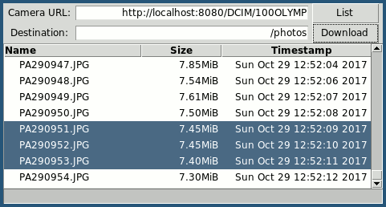

Olympus Photosync
=================

.. class:: no-web no-pdf

|pypi| |build| |license|

List, download and sync photos and videos from WiFi enabled Olympus cameras.

|Asciinema|

All functionality has been verified to work with the following digital cameras:

- Olympus E-M10

However, cameras that use the same media sharing mechanism should work just
as well. With that mentioned, the list of cameras that *probably* work is:

- Olympus E-M1
- Olympus E-M5
- Olympus TG-860
- Olympus TG-5

Installation
------------

The latest stable version of olympus-photosync can be installed from pypi:

.. code-block:: bash

  $ pip install olympus-photosync

Usage
-----

::

  Usage: olympus-photosync [options] <get|list|sync> ...

  List, download and sync photos and videos from WiFi enabled Olympus cameras.

  Commands:
    get                     download files from camera
    list                    list media on camera
    sync                    pull missing files from camera

  General options:
    -h, --help              show this help message and exit
    -v, --version           show version number and exit
    -r, --parsable          no progress bars and no human readable dates and sizes

  Camera server options:
    -a, --addr ip|hostname  address of camera server (default: 192.168.0.10)
    -p, --port port         camera server port number (default: 80)
    -b, --baseurl path      url under which media is located (default: /DCIM/100OLYMP)
    -t, --timeout seconds   connection timeout (default: 60)

  Download options:
    -d, --destdir           destination directory (default: ./)
    name [name ...]         media files to download (example: PA290940.JPG)

  Synchronization options:
    destdir                 directory which to download media files

  Filter options:
    --older timefmt         select files older than $timefmt
    --newer timefmt         select files newer than $timefmt
    --on timefmt            select media from a specific day

  Examples:
    olympus-photosync list --newer 2017-09-17T16:21:00 --older 2017-09-20
    olympus-photosync list --newer 10d --older 12h
    olympus-photosync list --on today
    olympus-photosync get --destdir ~/photos P8060697.JPG P7250454.MOV
    olympus-photosync get --destdir ~/photos "*.jpg"
    olympus-photosync sync ~/photos

A cross-platform GUI is provided by the ``olympus-photosync-gui`` program. At
the moment it can be used to list and download files from supported devices.

Todo
----

- Test on more cameras.
- Test on Windows.
- The GUI needs more work (e.g. add thumbnails, improve usability).
- Provide a standalone binary for Windows using PyInstaller.

Alternatives
------------

- `olympus-photosync`_: A well-tested command-line application written in Scala.

License
-------

Released under the terms of the `Revised BSD License`_.

.. |pypi| image:: https://img.shields.io/pypi/v/olympus-photosync.svg?style=flat-square&label=latest%20stable%20version
    :target: https://pypi.python.org/pypi/olympus-photosync
    :alt: Latest version released on PyPi

.. |license| image:: https://img.shields.io/pypi/l/olympus-photosync.svg?style=flat-square&label=license
    :target: https://pypi.python.org/pypi/olympus-photosync
    :alt: BSD 3-Clause

.. |build| image:: https://img.shields.io/travis/gvalkov/olympus-photosync/master.svg?style=flat-square&label=build
    :target: http://travis-ci.org/gvalkov/python-olympus-photosync
    :alt: Build status

.. |Asciinema| image:: https://asciinema.org/a/i1og9KbzvspJsKpO3aOzFhZfA.png
    :target: https://asciinema.org/a/i1og9KbzvspJsKpO3aOzFhZfA?theme=monokai&size=medium&autoplay=1&speed=1.2
    :alt: Asciinema terminal recording

.. _`Revised BSD License`: https://raw.github.com/gvalkov/olympus-photosync/master/LICENSE
.. _`olympus-photosync`:  https://github.com/mauriciojost/olympus-photosync
